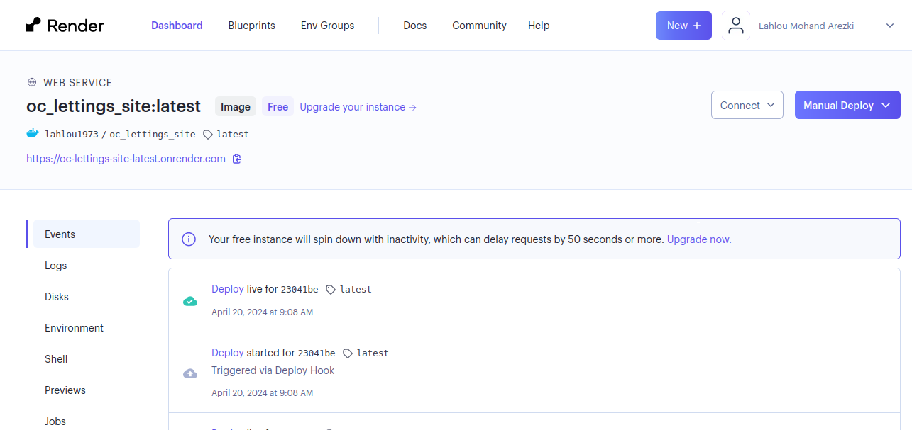

Mise en place d un pipeline CI/CD
=================================

Dans ce guide, nous allons utiliser GitHub Actions pour automatiser le déploiement de votre application Django à l'aide de Docker et Render. Voici les étapes nécessaires pour réaliser cela.

Installation de Docker
----------------------

Vous pouvez installer Docker en utilisant le package Python docker. Voici comment procéder :

1. **Installation de Docker via pip** :

   Assurez-vous que pip est à jour :

   ::

       pip install --upgrade pip

   Installez le package Docker :

   ::

       pip install docker

   Vérifiez l'installation en exécutant :

   ::

       docker --version

Création d'un compte Docker Hub
-------------------------------

Docker Hub est une plateforme pour stocker et partager des images Docker. Voici comment créer un compte :

1. **Accédez à Docker Hub** :

   Rendez-vous sur https://hub.docker.com/ et cliquez sur "Sign Up" pour créer un compte.

2. **Remplissez les informations** :

   Remplissez les informations requises et acceptez les conditions d'utilisation.

.. image:: _static/oc_lettings/docker_created.png
    :align: center

Liaison de votre compte Docker Hub avec le projet
-------------------------------------------------

Pour intégrer Docker à votre projet, vous devez créer un Dockerfile à la racine de votre projet. Voici comment procéder :

1. **Créez un Dockerfile** :

   Assurez-vous d'avoir un fichier Dockerfile à la racine de votre projet. Voici un exemple de contenu pour votre Dockerfile :

   ::

       FROM python:3.11

       WORKDIR /usr/src/app

       ENV PYTHONDONTWRITEBYTECODE 1
       ENV PYTHONUNBUFFERED 1
       ENV PORT 8000

       COPY . .

       RUN python3 -m pip install -r requirements.txt --no-cache-dir

       RUN python manage.py collectstatic --noinput

       CMD python manage.py runserver 0.0.0.0:$PORT

Construction et publication de l'image Docker
---------------------------------------------

Une fois votre Dockerfile prêt, vous pouvez construire et publier votre image Docker sur Docker Hub. Voici comment faire :

1. **Connexion à Docker Hub** :

   Assurez-vous d'être connecté à votre compte Docker Hub en utilisant la commande ``docker login``.

2. **Construction de l'image Docker** :

   Utilisez la commande suivante pour construire votre image Docker :

   ::

       docker build . -t votre_nom_utilisateur/nom_projet:latest

3. **Publication de l'image sur Docker Hub** :

   Publiez votre image sur Docker Hub en utilisant la commande suivante :

   ::

       docker push votre_nom_utilisateur/nom_projet:latest

   Assurez-vous de remplacer ``votre_nom_utilisateur`` et ``nom_projet`` par vos propres valeurs.

.. image:: _static/oc_lettings/docker_images_pushed.png
    :align: center

Test de l'image Docker localement
---------------------------------

Vous pouvez télécharger et exécuter votre image Docker localement pour tester votre application. Voici comment faire :

1. **Téléchargement de l'image depuis Docker Hub** :

   Utilisez la commande suivante pour télécharger votre image depuis Docker Hub :

   ::

       docker pull votre_nom_utilisateur/nom_projet:latest

2. **Exécution de l'image localement** :

   Exécutez votre image téléchargée en utilisant la commande suivante :

   ::

       docker run -p 8000:8000 votre_nom_utilisateur/nom_projet:latest

   Assurez-vous que le port spécifié correspond au port utilisé par votre application Django.

Déploiement sur Render
-----------------------

Une fois votre image Docker publiée, vous pouvez la déployer sur Render. Voici les étapes pour cela :

1. **Créez un compte Render** :

   Rendez-vous sur https://render.com/ et inscrivez-vous pour créer un compte Render.

2. **Créez un nouveau service** :

   Une fois connecté, cliquez sur "New +" puis sélectionnez "Docker Service".
    

3. **Configurez le service** :

   Suivez les instructions pour configurer votre service Docker sur Render. Vous devrez spécifier l'image Docker que vous avez publiée sur Docker Hub et les variables d Environnement.

.. image:: _static/oc_lettings/render_env.png
    :align: center

Pipeline CI/CD avec GitHub Actions
-----------------------------------

Ce fichier détaille le pipeline CI/CD utilisant GitHub Actions pour automatiser la construction, les tests et le déploiement de votre application Django.

**Définition du Pipeline**

Le pipeline est défini dans le fichier `.github/workflows/django.yml`. Voici une explication de son contenu :

1. **Définition du nom et des déclencheurs** :
   - `name`: "Django CI/CD".
   - `on`: Les événements déclencheurs, tels que les push sur la branche `master` et les pull requests.

2. **Définition des jobs** :
   - Le pipeline comporte deux jobs : `build_and_test` et `build_and_push_docker`.
   - Chaque job est constitué d'un ensemble d'étapes (`steps`) à exécuter séquentiellement.

3. **Job `build_and_test`** :
   - Responsable de la construction, des tests et de la vérification du code.
   - `runs-on`: Environnement d'exécution, `ubuntu-latest`.
   - `strategy`: Stratégie de parallélisation.
   - `steps`: Les étapes du job.

4. **Job `build_and_push_docker`** :
   - Construction et publication de l'image Docker.
   - `runs-on`: Environnement d'exécution, `ubuntu-latest`.
   - `needs`: Dépendances du job.
   - `if`: Condition pour exécuter le job.

   - **Étapes** :
     - Récupération des fichiers du référentiel.
     - Configuration du message de commit Git.
     - Construction de l'image Docker.
     - Connexion à Docker Hub.
     - Publication de l'image sur Docker Hub.

Ces étapes assurent la construction, les tests et le déploiement automatiques de votre application Django à chaque push sur la branche `master`.

5. **Gestion des donnees sensibles**
   La zone secrets dans GitHub Actions est utilisée pour stocker des informations sensibles telles que des jetons d'authentification, des clés API et d'autres données sensibles. Ces secrets sont chiffrés et ne sont accessibles qu'aux workflows de votre référentiel. Ils peuvent être référencés dans vos workflows pour sécuriser les opérations d'intégration continue et de déploiement continu (CI/CD) sans exposer les informations sensibles dans le code source.

   Dans l'exemple donné, nous utilisons la zone secrets pour stocker les informations sensibles suivantes :

    - ${{ secrets.RENDER_TOKEN }} : Jeton d'authentification Render. Utilisé pour déployer l'application sur la plateforme Render.
    - ${{ secrets.DOCKER_HUB_USERNAME }} : Nom d'utilisateur Docker Hub. Utilisé pour se connecter à Docker Hub et publier des images Docker.
    - ${{ secrets.DOCKER_HUB_PASSWORD }} : Mot de passe Docker Hub. Utilisé pour se connecter à Docker Hub et publier des images Docker.

   Ces secrets sont déclarés dans les paramètres du référentiel GitHub et sont accessibles dans les workflows via des variables d'environnement sécurisées.

Voici le contenu du fichier ``.github/workflows/django.yml`` :

.. code-block:: yaml
   :linenos:

   name: Django CI/CD

   on:
     push:
       branches: [ "master" ]
     pull_request:
       branches: [ "master" ]

   jobs:
     build_and_test:
       name: Build and Test
       runs-on: ubuntu-latest
       strategy:
         max-parallel: 4
         matrix:
           python-version: [3.11]

       steps:
         - name: Checkout Repository
           uses: actions/checkout@v3

         - name: Set up Python
           uses: actions/setup-python@v3
           with:
             python-version: ${{ matrix.python-version }}

         - name: Install Dependencies
           run: |
             python -m pip install --upgrade pip
             pip install -r requirements.txt

         - name: Generate staticfiles
           run: |
             python manage.py collectstatic --noinput

         - name: Run Tests
           run: |
             python manage.py test

         - name: Linting
           run: |
             flake8

         - name: Run tests with coverage
           if: steps.linting.outcome == ''
           run: |
             coverage run --source='.' manage.py test
             coverage report --fail-under=80

     build_and_push_docker:
       name: Build and Push Docker Image
       runs-on: ubuntu-latest
       needs: [build_and_test]
       if: github.ref == 'refs/heads/master' 
       steps:
         - name: Checkout Repository
           uses: actions/checkout@v3

         - name: Set Git Commit Message
           run: echo "COMMIT_MESSAGE=$(git log --format=%B -n 1 | tr -d '\n' | tr -cd '[:alnum:]-._')" >> $GITHUB_ENV

         - name: Build Docker image
           run: |
             docker build . \
             --file Dockerfile \
             --tag votre_nom_utilisateur/nom_projet:$(git rev-parse HEAD) \
             --tag votre_nom_utilisateur/nom_projet:latest

         - name: Log in to Docker Hub
           run: echo ${{ secrets.DOCKER_HUB_PASSWORD }} | docker login --username ${{ secrets.DOCKER_HUB_USERNAME }} --password-stdin

         - name: Push Docker image to Docker Hub
           run: |
             docker push votre_nom_utilisateur/nom_projet:$(git rev-parse HEAD)
             docker push votre_nom_utilisateur/nom_projet:latest

