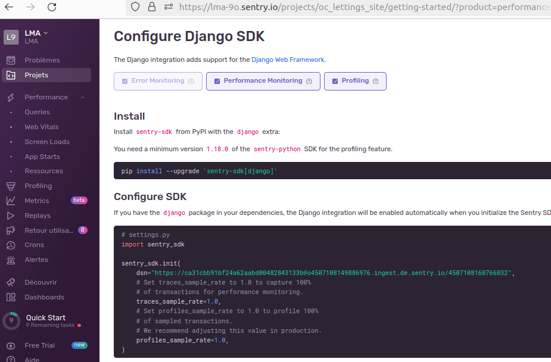

.. image:: https://img.shields.io/badge/Sentry-issues-red
   :target: https://www.sentry.io/

Surveillance de l'application et suivi des erreurs via Sentry
==============================================================

Mettre en place de Sentry
--------------------------
Pour surveiller votre application à l'aide de Sentry, suivez les étapes suivantes :

1. Créez un compte sur la plateforme Sentry en vous rendant sur `https://sentry.io`.
2. Créez un projet "Django".

3. Configurez le projet "Django"

4. Installation
Installez sentry-sdk depuis PyPI avec l'extra django :

.. code-block:: shell

   pip install --upgrade 'sentry-sdk[django]'

5. Configurez le SDK

Si vous avez le package django dans vos dépendances, l'intégration Django sera activée automatiquement lorsque vous initialiserez le SDK Sentry. Initialisez le SDK Sentry dans votre fichier settings.py Django :

.. code-block:: python

   # settings.py
   import sentry_sdk

   sentry_sdk.init(
       dsn="https://300a1b45f5eb8a75cb3f4daf9cd2400c@o4507108149886976.ingest.de.sentry.io/4507108292427856",
       # Définissez traces_sample_rate sur 1.0 pour capturer 100%
       # des transactions pour la surveillance des performances.
       traces_sample_rate=1.0,
       # Définissez profiles_sample_rate sur 1.0 pour profiler 100%
       # des transactions échantillonnées.
       # Nous vous recommandons d'ajuster cette valeur en production.
       profiles_sample_rate=1.0,
   )

6. Vérification

Vous pouvez facilement vérifier votre installation Sentry en créant une route qui déclenche une erreur :

.. code-block:: python

   # urls.py
   from django.urls import path

   def trigger_error(request):
       division_by_zero = 1 / 0

   urlpatterns = [
       path('sentry-debug/', trigger_error),
       # ...
   ]

Configuration des logs
-----------------------

La gestion des erreurs est complétée en utilisant le module de logging.

.. code-block:: python
    :linenos:

    # oc_lettings_site/settings.py

    # Generate logging file name
    today = datetime.datetime.now().strftime("%Y-%m-%d")
    LOGGING_FILE = os.path.join(LOGGING_DIR, f"{today}.log")

    # Handlers manage the destination and format of logs
    LOGGING = {
        "version": 1,  # Logging configuration version
        "disable_existing_loggers": False,  # Do not disable existing loggers
        # Formatters define the format of log messages
        "formatters": {
            "standard": {
                "format": "%(levelname)-8s %(asctime)s %(module)s %(message)s",
                "datefmt": "%Y-%m-%d %H:%M:%S",
            },
        },
        # Handlers manage the destination and format of logs
        "handlers": {
            "sentry": {
                "level": "WARNING",  # Log level for Sentry
                "class": "sentry_sdk.integrations.logging.EventHandler",
            },
            "console": {
                "class": "logging.StreamHandler",  # Output logs to console
                "formatter": "standard",  # Use the standard formatter
            },
            "file": {
                "level": "INFO",  # Log level for file
                "class": "logging.FileHandler",  # Handler for writing to a file
                "filename": LOGGING_FILE,  # Path to the log file
                "formatter": "standard",  # Use the standard formatter
            },
        },
        # Loggers specify handlers and log level
        "loggers": {
            "django": {
                "handlers": [
                    "sentry",
                    "console",
                    "file",
                ],  # Handlers used by this logger
                "level": "WARNING",  # Log level for Django
                "propagate": True,  # Propagate logs to parent loggers
            },
            "lettings": {
                "handlers": ["sentry", "console", "file"],
                "level": "INFO",
                "propagate": False,
            },
            "profiles": {
                "handlers": ["sentry", "console", "file"],
                "level": "INFO",
                "propagate": False,
            },
            "oc_lettings_site": {
                "handlers": ["sentry", "console", "file"],
                "level": "INFO",
                "propagate": False,
            },
        },
    }

Les logs vont être sauvegardés dans un fichier sous le format <YYYY-MM-DD.log> dans le dossier <logging>.

.. code-block:: bash

    # logging/2024-04-19.log

    ERROR    2024-04-19 06:52:30 log Internal Server Error: /sentry-debug/
    Traceback (most recent call last):
    File "/home/lahlou/P13/venv/lib/python3.11/site-packages/django/core/handlers/exception.py", line 55, in inner
        response = get_response(request)
                ^^^^^^^^^^^^^^^^^^^^^
    File "/home/lahlou/P13/venv/lib/python3.11/site-packages/django/core/handlers/base.py", line 197, in _get_response
        response = wrapped_callback(request, *callback_args, **callback_kwargs)
                ^^^^^^^^^^^^^^^^^^^^^^^^^^^^^^^^^^^^^^^^^^^^^^^^^^^^^^^^^^^^
    File "/home/lahlou/P13/venv/lib/python3.11/site-packages/sentry_sdk/integrations/django/views.py", line 84, in sentry_wrapped_callback
        return callback(request, *args, **kwargs)
            ^^^^^^^^^^^^^^^^^^^^^^^^^^^^^^^^^^
    File "/home/lahlou/P13/oc_lettings_site/urls.py", line 11, in trigger_error
        division_by_zero = 1 / 0
                        ~~^~~
    ZeroDivisionError: division by zero
    ERROR    2024-04-19 06:52:30 basehttp "GET /sentry-debug/ HTTP/1.1" 500 3496
    INFO     2024-04-19 11:30:41 views Displaying details of letting ID:1
    INFO     2024-04-19 11:30:41 views Displaying the list of lettings.
    INFO     2024-04-19 11:30:41 views Displaying home page.
    INFO     2024-04-19 11:30:42 views Displaying details of : UserTest
    INFO     2024-04-19 11:30:42 views Displaying profiles list.
