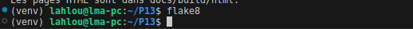
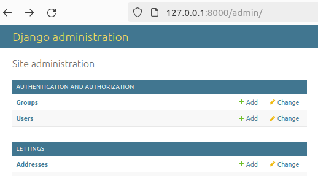

Réduire diverses dettes techniques existantes dans le projet
============================================================

Correction des erreurs de linting
-----------------------------------

Résolution des erreurs de linting tout en préservant la configuration du linting dans setup.cfg et en maintenant les commentaires intacts.

Correction de la pluralisation pour le terme "address"
------------------------------------------------------

.. code-block:: python

   # lettings/models.py
   class Address(models.Model):
         .
         .
         .
      class Meta:
         """
         Meta options for the Address model.
         Attributes:
            verbose_name_plural (str): The plural name for the model in the admin interface.
         """
         verbose_name_plural = "addresses"

Gestion des erreurs 404 et 500
-------------------------------

   .. code-block:: python

      # oc_lettings_site/urls.py

      handler404 = 'oc_lettings_site.views.handler404'
      handler500 = 'oc_lettings_site.views.handler500'

   .. code-block:: python

      # oc_lettings_site/views.py

      def handler404(request: HttpRequest, exception: Exception):
         """
         View function for handling 404 errors.

         Parameters:
            request (HttpRequest): The HTTP request object.
            exception (Exception): The exception object representing the 404 error.

         Returns:
            HttpResponse: Rendered response for the 404 error page.
         """
         return render(request, '404.html', status=404)

      def handler500(request: HttpRequest):
         """
         View function for handling 500 errors.

         Parameters:
            request (HttpRequest): The HTTP request object.

         Returns:
            HttpResponse: Rendered response for the 500 error page.
         """
         return render(request, '500.html', status=500)
     
   - Erreur 404
      
   .. image:: _static/oc_lettings/404_page.png
      :align: center
   
   - Erreur 500
         
   .. image:: _static/oc_lettings/500_page.png
      :align: center  

Documentation du code en gardant les commentaires existants
------------------------------------------------------------

.. code-block:: python
      
   # oc_lettings_site/views.py
         
   # Aliquam sed metus eget nisi tincidunt ornare accumsan eget lac
   # laoreet neque quis, pellentesque dui. Nullam facilisis pharetra vulputate. Sed tincidunt,
   # dolor id facilisis fringilla, eros leo tristique lacus, it. Nam aliquam dignissim congue.
   # Pellentesque habitant morbi tristique senectus et netus et males
   def profile(request, username):
      """
      Displays details of a profile.

      This view retrieves the profile corresponding to the given username
      from the database. If no matching profile is found, a 404 error is
      returned. Otherwise, the profile details are rendered in the
      'profiles/profile.html' template.

      Parameters:
      - request : HttpRequest
         The HTTP request received by the view.
      - username : str
         The username of the profile to display.

      Returns:
      - HttpResponse
         An HTTP response containing the profile details rendered in the template.
      """
      profile = get_object_or_404(Profile, user__username=username)
      logger.info(f"Displaying details of : {username}")
      context = {'profile': profile}
      return render(request, 'profiles/profile.html', context)

Mise en place des tests unitaires
---------------------------------

   - Ecriture des tests unitaires et d’intégrations pour les vues, les URL et les modèles afin de garantir la qualité et le bon fonctionnement de notre application.
         
   .. code-block:: python
      
      # lettings/tests.py
            
      from django.test import TestCase
      from django.urls import reverse
      from .models import Address, Letting

      class LettingsTest(TestCase):
         """
         Test case for the Lettings app.
         """

         def setUp(self):
            """
            Set up the test data before each test method.
            """
            # Creates instances of Address and Letting for testing
            self.address = Address.objects.create(
                  number=2,
                  street="Boulevard test 1",
                  city="City 1",
                  state="State1",
                  zip_code=669988,
                  country_iso_code="FRA"
            )
            self.letting = Letting.objects.create(title="Test Letting", address=self.address)

         def test_lettings_index(self):
            """
            Test the index view of the Lettings app.
            """
            # Checks if the index page returns a status code 200 and
            # if the title is present in the content
            response = self.client.get(reverse('lettings:index'))
            self.assertEqual(response.status_code, 200)
            self.assertContains(response, "<title>Lettings</title>")

         def test_letting_detail(self):
            """
            Test the letting detail view of the Lettings app.
            """
            # Checks if the letting detail page returns a status code 200
            # and if the title of the letting is present in the content
            response = self.client.get(reverse('lettings:letting', args=[1]))
            self.assertEqual(response.status_code, 200)
            self.assertContains(response, "<title>Test Letting</title>")

         def test_lettings_models_str(self):
            """
            Test the __str__ methods of the Address and Letting models.
            """
            # Checks if the string representation of the instances matches the expected format
            self.assertEqual(str(self.address), f'{self.address.number} {self.address.street}')
            self.assertEqual(str(self.letting), self.letting.title)

   - Vérification de la couverture des tests

   .. code-block:: bash

      (venv) lahlou@lma-pc:~/P13$ coverage run manage.py test
      Found 9 test(s).
      Creating test database for alias 'default'...
      System check identified no issues (0 silenced).
      /home/lahlou/P13/venv/lib/python3.11/site-packages/sentry_sdk/integrations/django/middleware.py:134: UserWarning: No directory at: /home/lahlou/P13/staticfiles/
      self._inner = middleware(get_response, *args, **kwargs)
      INFO     2024-04-19 11:30:41 views Displaying details of letting ID:1
      INFO     2024-04-19 11:30:41 views Displaying the list of lettings.
      ...
      INFO     2024-04-19 11:30:42 views Displaying details of : UserTest
      INFO     2024-04-19 11:30:42 views Displaying profiles list.
      ..
      ----------------------------------------------------------------------
      Ran 9 tests in 2.641s

      OK
      Destroying test database for alias 'default'...
      (venv) lahlou@lma-pc:~/P13$ coverage report
      Name                           Stmts   Miss  Cover
      --------------------------------------------------
      lettings/__init__.py               0      0   100%
      lettings/admin.py                  5      0   100%
      lettings/apps.py                   4      0   100%
      lettings/models.py                18      0   100%
      lettings/urls.py                   4      0   100%
      lettings/views.py                 14      0   100%
      manage.py                         11      2    82%
      oc_lettings_site/__init__.py       0      0   100%
      oc_lettings_site/apps.py           3      0   100%
      oc_lettings_site/settings.py      34      1    97%
      oc_lettings_site/urls.py           9      2    78%
      oc_lettings_site/views.py         11      0   100%
      profiles/__init__.py               0      0   100%
      profiles/admin.py                  3      0   100%
      profiles/apps.py                   4      0   100%
      profiles/models.py                 7      0   100%
      profiles/urls.py                   4      0   100%
      profiles/views.py                 14      0   100%
      --------------------------------------------------
      TOTAL                            145      5    97%